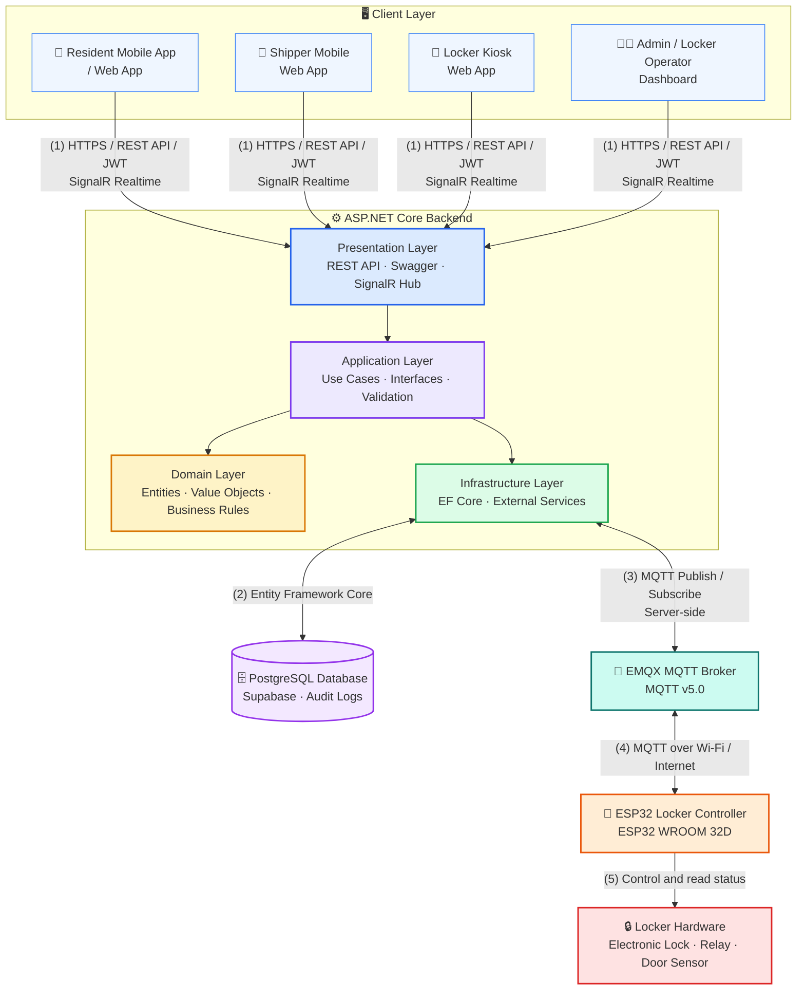

<p align="center">
  
</p>

<p align="center">
  
</p>

<p align="center">
  <strong>Language:</strong>
  <a href="./README.vn.md">🇻🇳 Tiếng Việt</a>
  &nbsp;|&nbsp;
  <a href="./README.md">🇬🇧 English</a>
</p>

<h3 align="center">
  ⚙️ Backend API for SDLMS
</h3>

<p align="center">
  A smart parcel delivery management platform with real-time connectivity and IoT integration.
</p>

<p align="center">
  
  
  
  
  
  
</p>

<p align="center">
  <a href="#quick-start"></a>
  <a href="#tech-stack"></a>
  <a href="#architecture"></a>
  <a href="#related-repositories"></a>
  <a href="#development-team"></a>
</p>

## Overview

`smart-locking-be` is the core Backend API of the Boxora system. It handles business logic, authentication, parcel workflows, locker allocation, system auditing, real-time communication, and IoT device orchestration.

### Main Modules

* **Identity & Access** — manages authentication, JWT tokens, roles, permissions, and account status.
* **Resident Management** — manages resident registration, profiles, delivery preferences, and parcel history.
* **Shipper Guest Workflow** — supports temporary guest sessions for parcel drop-off without account registration.
* **Parcel Management** — manages parcel approval, storage, retrieval, overdue handling, and delivery records.
* **Locker Management** — manages buildings, locker clusters, compartments, availability, and dynamic allocation.
* **Locker Operations** — supports monitoring, incident handling, audited emergency actions, and maintenance requests.
* **Realtime & IoT Integration** — communicates with clients through SignalR and with locker devices through MQTT.
* **Administration & Audit** — manages system policies, operator assignments, reports, and audit logs.

---

<a id="quick-start"></a>

<details open>
<summary><strong>🚀 Quick Start</strong></summary>

### Requirements

Install these tools before running the project:

* .NET SDK 8.x. The solution targets `net8.0`; keep the project packages on .NET/EF Core 8.
* PostgreSQL 15+ locally, or a Supabase PostgreSQL database.
* EF Core CLI 8.0.11 for database migrations.
* Docker: optional, only needed if you want to run infrastructure locally with containers.

```bash
dotnet --version
dotnet tool update --global dotnet-ef --version 8.0.11
dotnet ef --version
```

Current NuGet versions used by this repository:

| Project | Package | Version |
| ------- | ------- | ------- |
| `smart-locking-be.API` | `Microsoft.AspNetCore.Authentication.JwtBearer` | `8.0.28` |
| `smart-locking-be.API` | `Serilog.AspNetCore` | `8.0.3` |
| `smart-locking-be.API` | `Serilog.Settings.Configuration` | `8.0.4` |
| `smart-locking-be.API` | `Serilog.Sinks.Console` | `5.0.1` |
| `smart-locking-be.API` | `Serilog.Sinks.File` | `5.0.0` |
| `smart-locking-be.API` | `Swashbuckle.AspNetCore` | `6.9.0` |
| `smart-locking-be.Application` | `Microsoft.Extensions.DependencyInjection.Abstractions` | `8.0.2` |
| `smart-locking-be.Infrastructure` | `Microsoft.EntityFrameworkCore.Design` | `8.0.11` |
| `smart-locking-be.Infrastructure` | `Microsoft.Extensions.Configuration.Abstractions` | `8.0.0` |
| `smart-locking-be.Infrastructure` | `Microsoft.Extensions.DependencyInjection.Abstractions` | `8.0.2` |
| `smart-locking-be.Infrastructure` | `Npgsql.EntityFrameworkCore.PostgreSQL` | `8.0.11` |
| `smart-locking-be.Tests` | `coverlet.collector` | `6.0.0` |
| `smart-locking-be.Tests` | `Microsoft.NET.Test.Sdk` | `17.8.0` |
| `smart-locking-be.Tests` | `xunit` | `2.5.3` |
| `smart-locking-be.Tests` | `xunit.runner.visualstudio` | `2.5.3` |

These versions are compatible with the current `net8.0` projects. Do not upgrade EF Core packages or `dotnet-ef` to 9.x unless the solution is intentionally migrated to .NET 9.

### Installation

```bash
git clone https://github.com/se-05-sdlms/smart-locking-be
cd smart-locking-be
dotnet restore
```

### Configuration

Create a local development settings file for your machine. This file is ignored by Git, so every team member needs to create it locally.

```bash
# macOS/Linux/Git Bash
cp smart-locking-be.API/appsettings.json smart-locking-be.API/appsettings.Development.json

# Windows PowerShell
Copy-Item smart-locking-be.API/appsettings.json smart-locking-be.API/appsettings.Development.json
```

Open `smart-locking-be.API/appsettings.Development.json` and update at least these values:

```json
{
  "ConnectionStrings": {
    "DefaultConnection": "Host=localhost;Port=5432;Database=smart_locking_dev;Username=postgres;Password=postgres"
  },
  "Jwt": {
    "Key": "development-only-secret-key-please-change-32-bytes",
    "Issuer": "smart-locking-be",
    "Audience": "smart-locking-clients"
  }
}
```

You can also override settings through environment variables or .NET User Secrets:

```env
ConnectionStrings__DefaultConnection=
Jwt__Key=
Jwt__Issuer=
Jwt__Audience=
```

### Run the Development Environment

```bash
# Restore dependencies
dotnet restore

# Run the API with the http launch profile
dotnet run --project smart-locking-be.API --launch-profile http
```

* Local API URL: `http://localhost:5005`
* Swagger URL: `http://localhost:5005/swagger`
* Sample endpoint: `http://localhost:5005/weatherforecast`

To run the HTTPS profile:

```bash
dotnet run --project smart-locking-be.API --launch-profile https
```

* HTTPS URL: `https://localhost:7001`
* HTTP URL: `http://localhost:5005`

To apply EF Core migrations after entities and migrations exist:

```bash
dotnet ef database update \
  --project smart-locking-be.Infrastructure \
  --startup-project smart-locking-be.API
```

</details>

<a id="tech-stack"></a>

<details open>
<summary><strong>🧰 Tech Stack</strong></summary>

| Category            | Technology                               |
| ------------------- | ---------------------------------------- |
| Framework           | ASP.NET Core Web API, .NET 8 LTS         |
| Architecture        | Clean Architecture                       |
| ORM                 | Entity Framework Core 8.0.11             |
| Database            | PostgreSQL 15+, Supabase                 |
| Authentication      | JWT Bearer Token                         |
| API documentation   | Swashbuckle.AspNetCore 6.9.0, Swagger UI |
| Logging             | Serilog.AspNetCore 8.0.3                 |
| Testing             | xUnit 2.5.3                              |
| Code coverage       | coverlet.collector 6.0.0                 |
| Containerization    | Docker: optional                         |

</details>

<a id="architecture"></a>

<details open>
<summary><strong>🏗️ Architecture</strong></summary>



The Backend is the only application layer that communicates directly with the database and MQTT Broker. Frontend, Mobile, and Kiosk clients communicate with the Backend through REST APIs and SignalR.

</details>

<details open>
<summary><strong>🔐 Environment Variables</strong></summary>

Configure sensitive values through `smart-locking-be.API/appsettings.Development.json`, environment variables, or .NET User Secrets.

```env
ConnectionStrings__DefaultConnection=
Jwt__Key=
Jwt__Issuer=
Jwt__Audience=
```

Do not store real secrets in source code or commit production configuration files to Git.

</details>

<details>
<summary><strong>🧪 Build, Test, and Format</strong></summary>

```bash
# Restore dependencies
dotnet restore

# Build the solution in Debug
dotnet build smart-locking-be.sln

# Build the solution in Release
dotnet build smart-locking-be.sln --configuration Release

# Run all tests
dotnet test smart-locking-be.sln

# Verify code formatting
dotnet format --verify-no-changes

# List package versions
dotnet list smart-locking-be.sln package

# Add a database migration after adding or changing entities
dotnet ef migrations add InitialCreate \
  --project smart-locking-be.Infrastructure \
  --startup-project smart-locking-be.API \
  --output-dir Persistence/Migrations

# Apply database migrations
dotnet ef database update \
  --project smart-locking-be.Infrastructure \
  --startup-project smart-locking-be.API
```

</details>

<details>
<summary><strong>📁 Project Structure</strong></summary>

```text
smart-locking-be/
├── docs/
│   └── images/
├── smart-locking-be.API/
│   ├── Constants/
│   ├── Controllers/
│   ├── Extensions/
│   ├── Options/
│   ├── Properties/
│   │   └── launchSettings.json
│   ├── appsettings.json
│   └── Program.cs
├── smart-locking-be.Application/
│   └── DependencyInjection.cs
├── smart-locking-be.Domain/
│   └── smart-locking-be.Domain.csproj
├── smart-locking-be.Infrastructure/
│   ├── Persistence/
│   │   └── ApplicationDbContext.cs
│   └── DependencyInjection.cs
├── smart-locking-be.Tests/
│   └── Test.cs
├── README.md
├── README.vn.md
└── smart-locking-be.sln
```

</details>

<a id="related-repositories"></a>

<details open>
<summary><strong>🔗 Related Repositories and Documentation</strong></summary>

| Component             | Link                                                                                                 |
| --------------------- | ---------------------------------------------------------------------------------------------------- |
| GitHub Organization   | [se-05-sdlms](https://github.com/se-05-sdlms)                                                        |
| Frontend              | [smart-locking-fe](https://github.com/se-05-sdlms/smart-locking-fe)                                  |
| Mobile                | [smart-locking-mobile](https://github.com/se-05-sdlms/smart-locking-mobile)                          |
| Project Documentation | [Google Drive](https://drive.google.com/drive/folders/1M3OPsm2NxAi7WnAfsKgV4MQEMRy5rOsa?usp=sharing) |

</details>

<a id="development-team"></a>

<details open>
<summary><strong>👥 Development Team</strong></summary>

* **Project code:** `SDLMS`
* **Group:** `SE_05`

### Supervisor

| Full name            | Role       | Email                                       |
| -------------------- | ---------- | ------------------------------------------- |
| MSc. Lê Thị Bích Tra | Supervisor | [traltb@fe.edu.vn](mailto:traltb@fe.edu.vn) |

### Members

| Student ID | Full name            | Role        | Email                                                             |
| ---------- | -------------------- | ----------- | ----------------------------------------------------------------- |
| DE180519   | Nguyễn Phan Huy      | Team Leader | [huynpde180519@fpt.edu.vn](mailto:huynpde180519@fpt.edu.vn)       |
| DE180405   | Phan Thành Vương     | Member      | [vuongptde180405@fpt.edu.vn](mailto:vuongptde180405@fpt.edu.vn)   |
| DE180313   | Võ Văn Hài           | Member      | [haivvde180313@fpt.edu.vn](mailto:haivvde180313@fpt.edu.vn)       |
| DE180393   | Trần Minh Cường      | Member      | [cuongtmde180393@fpt.edu.vn](mailto:cuongtmde180393@fpt.edu.vn)   |
| DE181072   | Trương Hà Thùy Trang | Member      | [trangthtde181072@fpt.edu.vn](mailto:trangthtde181072@fpt.edu.vn) |

</details>
