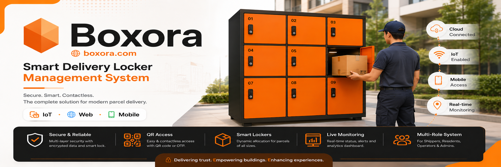
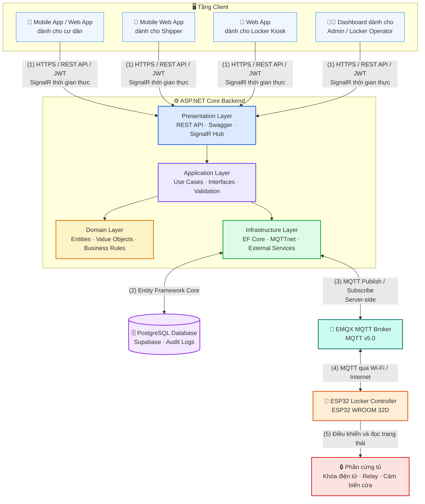

<p align="center">
  
</p>

<p align="center">
  
</p>

<p align="center">
  <strong>Ngôn ngữ:</strong>
  <a href="./README.vn.md">🇻🇳 Tiếng Việt</a>
  &nbsp;|&nbsp;
  <a href="./README.md">🇬🇧 English</a>
</p>

<h3 align="center">
  ⚙️ Backend API của SDLMS
</h3>

<p align="center">
  Nền tảng quản lý giao nhận bưu kiện thông minh, kết nối thời gian thực và tích hợp IoT.
</p>

<p align="center">
  
  
  
  
  
  
</p>

<p align="center">
  <a href="#quick-start"></a>
  <a href="#tech-stack"></a>
  <a href="#architecture"></a>
  <a href="#related-repositories"></a>
  <a href="#development-team"></a>
</p>

## Tổng quan

`smart-locking-be` là Backend API cốt lõi của hệ thống Boxora, chịu trách nhiệm xử lý nghiệp vụ, authentication, luồng bưu kiện, cấp phát ngăn tủ, audit hệ thống, giao tiếp thời gian thực và điều phối thiết bị IoT.

### Các module chính

* **Identity & Access** — quản lý authentication, JWT token, role, permission và trạng thái tài khoản.
* **Quản lý cư dân** — quản lý đăng ký, hồ sơ, tùy chọn giao hàng và lịch sử bưu kiện.
* **Luồng Shipper Guest** — hỗ trợ session tạm thời để gửi bưu kiện mà không cần đăng ký tài khoản.
* **Quản lý bưu kiện** — quản lý phê duyệt, lưu trữ, nhận hàng, xử lý quá hạn và lịch sử giao nhận.
* **Quản lý tủ** — quản lý tòa nhà, cụm tủ, ngăn tủ, trạng thái sẵn sàng và cấp phát ngăn động.
* **Vận hành tủ** — hỗ trợ giám sát, xử lý sự cố, thao tác khẩn cấp có audit và yêu cầu bảo trì.
* **Realtime & IoT Integration** — giao tiếp với client qua SignalR và với thiết bị tủ qua MQTT.
* **Quản trị & Audit** — quản lý policy, phân công Locker Operator, báo cáo và audit logs.

---

<a id="quick-start"></a>

<details open>
<summary><strong>🚀 Bắt đầu nhanh</strong></summary>

### Yêu cầu

* .NET SDK 8
* PostgreSQL 15+ hoặc Supabase
* EMQX 5.x
* Docker: không bắt buộc

### Cài đặt

```bash
git clone https://github.com/se-05-sdlms/smart-locking-be
cd smart-locking-be
dotnet restore
```

### Cấu hình

Cấu hình ứng dụng bằng `appsettings.Development.json`, biến môi trường hoặc .NET User Secrets.

```env
ConnectionStrings__DefaultConnection=
Jwt__Key=
Jwt__Issuer=
Jwt__Audience=
Mqtt__Host=
Mqtt__Port=
Mqtt__Username=
Mqtt__Password=
Mqtt__ClientId=
```

### Chạy môi trường phát triển

```bash
# THAY bằng đường dẫn API project thực tế trong repository
dotnet run --project <API_PROJECT_PATH>
```

* URL local: `http://localhost:<PORT>`
* Swagger URL: `http://localhost:<PORT>/swagger`

</details>

<a id="tech-stack"></a>

<details open>
<summary><strong>🧰 Công nghệ</strong></summary>

| Nhóm                | Công nghệ                                |
| ------------------- | ---------------------------------------- |
| Framework           | ASP.NET Core Web API, .NET 8 LTS         |
| Architecture        | Clean Architecture                       |
| ORM                 | Entity Framework Core 8                  |
| Database            | PostgreSQL 15+, Supabase                 |
| Authentication      | JWT Bearer Token                         |
| Realtime            | SignalR                                  |
| MQTT client         | MQTTnet 4.3+                             |
| MQTT broker         | EMQX 5.x                                 |
| Tài liệu API        | Swashbuckle.AspNetCore, Swagger UI       |
| Testing             | xUnit, Moq                               |
| Containerization    | Docker                                   |
| Cloud & CI/CD       | Google Cloud Run, GitHub Actions, OIDC   |

</details>

<a id="architecture"></a>

<details open>
<summary><strong>🏗️ Kiến trúc</strong></summary>



Backend là tầng ứng dụng duy nhất giao tiếp trực tiếp với database và MQTT Broker. Frontend, Mobile và Kiosk giao tiếp với Backend thông qua REST API và SignalR.

</details>

<details open>
<summary><strong>🔐 Biến môi trường</strong></summary>

Cấu hình các giá trị nhạy cảm bằng biến môi trường hoặc .NET User Secrets.

```env
# THAY bằng đúng tên configuration key được sử dụng trong source code
ConnectionStrings__DefaultConnection=
Jwt__Key=
Jwt__Issuer=
Jwt__Audience=
Mqtt__Host=
Mqtt__Port=
Mqtt__Username=
Mqtt__Password=
Mqtt__ClientId=
```

Không lưu secret thật trong source code hoặc commit file cấu hình production lên Git.

</details>

<details>
<summary><strong>🧪 Build, test và format</strong></summary>

```bash
# Restore dependency
dotnet restore

# Build solution
dotnet build --configuration Release

# Chạy toàn bộ test
dotnet test --configuration Release

# Kiểm tra format
dotnet format --verify-no-changes

# Áp dụng database migration
dotnet ef database update \
  --project <INFRASTRUCTURE_PROJECT_PATH> \
  --startup-project <API_PROJECT_PATH>
```

</details>

<details>
<summary><strong>📁 Cấu trúc dự án</strong></summary>

```text
smart-locking-be/
├── docs/
│   └── images/
│       └── readme-header.png
├── src/
│   ├── Domain/
│   ├── Application/
│   ├── Infrastructure/
│   └── Presentation/
├── tests/
├── appsettings.json
├── Dockerfile
├── README.vn.md
├── README.md
└── <SOLUTION_NAME>.sln
```

</details>

<a id="related-repositories"></a>

<details open>
<summary><strong>🔗 Repo và tài liệu liên quan</strong></summary>

| Thành phần           | Liên kết                                                                                             |
| -------------------- | ---------------------------------------------------------------------------------------------------- |
| GitHub Organization  | [se-05-sdlms](https://github.com/se-05-sdlms)                                                        |
| Frontend             | [smart-locking-fe](https://github.com/se-05-sdlms/smart-locking-fe)                                  |
| Mobile               | [smart-locking-mobile](https://github.com/se-05-sdlms/smart-locking-mobile)                          |
| Tài liệu dự án       | [Google Drive](https://drive.google.com/drive/folders/1M3OPsm2NxAi7WnAfsKgV4MQEMRy5rOsa?usp=sharing) |

</details>

<a id="development-team"></a>

<details open>
<summary><strong>👥 Nhóm phát triển</strong></summary>

* **Mã dự án:** `SDLMS`
* **Nhóm:** `SE_05`

### Giảng viên hướng dẫn

| Họ và tên            | Vai trò              | Email                                       |
| -------------------- | -------------------- | ------------------------------------------- |
| ThS. Lê Thị Bích Tra | Giảng viên hướng dẫn | [traltb@fe.edu.vn](mailto:traltb@fe.edu.vn) |

### Thành viên

| MSSV     | Họ và tên            | Vai trò     | Email                                                             |
| -------- | -------------------- | ----------- | ----------------------------------------------------------------- |
| DE180519 | Nguyễn Phan Huy      | Trưởng nhóm | [huynpde180519@fpt.edu.vn](mailto:huynpde180519@fpt.edu.vn)       |
| DE180405 | Phan Thành Vương     | Thành viên  | [vuongptde180405@fpt.edu.vn](mailto:vuongptde180405@fpt.edu.vn)   |
| DE180313 | Võ Văn Hài           | Thành viên  | [haivvde180313@fpt.edu.vn](mailto:haivvde180313@fpt.edu.vn)       |
| DE180393 | Trần Minh Cường      | Thành viên  | [cuongtmde180393@fpt.edu.vn](mailto:cuongtmde180393@fpt.edu.vn)   |
| DE181072 | Trương Hà Thùy Trang | Thành viên  | [trangthtde181072@fpt.edu.vn](mailto:trangthtde181072@fpt.edu.vn) |

</details>
